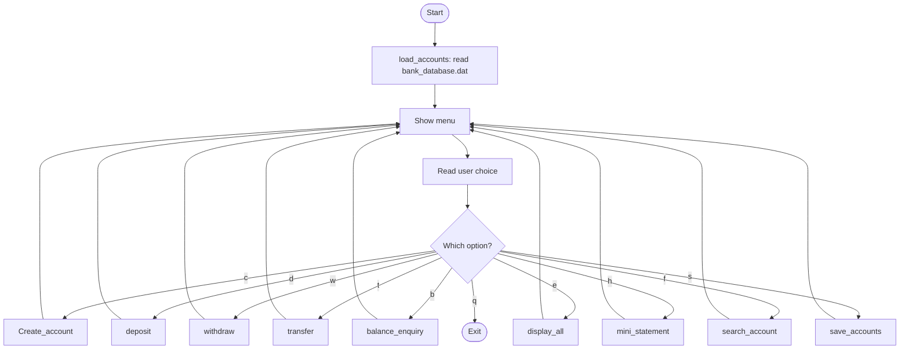
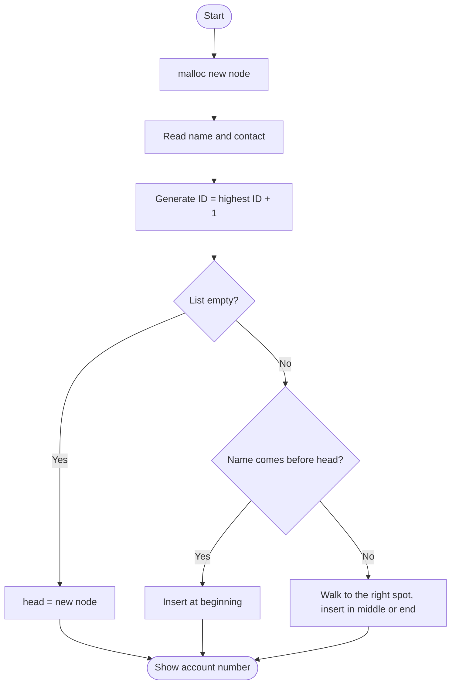
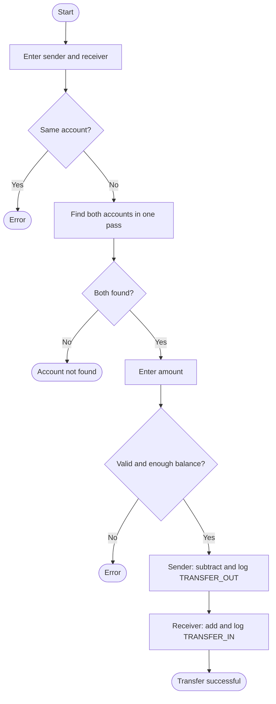
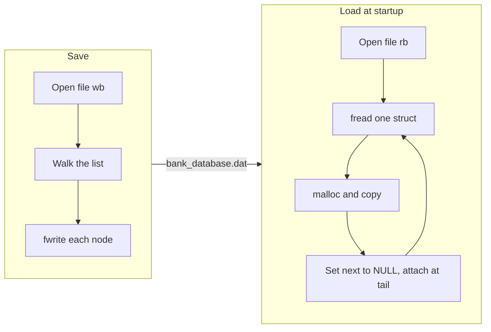

<div align="center">

# 🏦 Bank Account Management System

### A menu-driven banking application in **C**, built on a **singly linked list**


*Create accounts · Deposit · Withdraw · Transfer · Check balance · Mini statements · Save and reload your data*

</div>

---

## 📖 About the Project

This is a **console-based banking system** written in C. It shows how a classic Data Structures concept, the **singly linked list**, can power a real application.

Every bank account is a **node** in a linked list. Each operation (create, search, deposit, withdraw, transfer) is a list traversal plus some pointer work. Accounts are saved to a **binary file**, so your data is still there the next time you run the program.

The code is split into small files, one per feature, and they all share a single header. This keeps the project easy to read and easy to extend.

---

## ✨ Features

| Key | Feature | What it does |
|:---:|---------|--------------|
| `c` | **Create Account** | Registers a customer with an auto-generated account number |
| `d` | **Deposit** | Adds money to an account and records the transaction |
| `w` | **Withdraw** | Removes money, with an insufficient-funds check |
| `t` | **Transfer** | Moves money between two accounts, recorded on both sides |
| `b` | **Balance Enquiry** | Shows the owner's name and available balance |
| `e` | **Display All** | Lists every account in the system |
| `h` | **Mini Statement** | Shows the last 5 transactions of an account |
| `f` | **Search Account** | Finds an account by number and shows its details |
| `s` | **Save** | Writes all accounts to `bank_database.dat` |
| `q` | **Quit** | Exits the application |

**Highlights**

- 🔤 Accounts are kept **alphabetically sorted by name**
- 🔢 Account numbers are **auto-generated**, starting from `100001`
- 🔁 Transaction history is a **circular buffer** that keeps the latest 5 records
- 💾 Saved data is **loaded automatically** at startup
- 🛡️ Validation for invalid amounts, missing accounts, same-account transfers, and insufficient funds

---

## 🧠 Concepts Practiced

- Dynamic memory allocation with `malloc`
- Singly linked list: sorted insertion and traversal
- Circular buffer for fixed-size history
- `struct`, `enum`, and `typedef`
- Binary file handling with `fread` and `fwrite`
- Multi-file C programming with a shared header
- Separating headers (`include/`) from source files (`src/`)

---

## 📁 Project Structure

```text
Bank-management-system-c/
├── README.md
│
├── include/
│   ├── header.h              Includes standard libraries + bank_core.h
│   └── bank_core.h           Structs, enums, macros, function prototypes
│
└── src/
    ├── main.c                Menu loop and the global head pointer
    ├── create_account.c      Create account (sorted insertion)
    ├── deposit.c             Deposit and transaction logging
    ├── withdrawl.c           Withdraw with balance validation
    ├── transfer.c            Account-to-account transfer
    ├── balance_enquiey.c     Balance enquiry
    ├── display_all.c         Display every account
    ├── mini_statement.c      Last 5 transactions
    ├── serch_account.c       Search an account by number
    ├── save_accounts.c       Save the list to disk
    └── load_accounts.c       Rebuild the list from disk
```

`main.c` owns the one global pointer `Account *head`. Every other file reaches it with `extern Account *head;`.

---

## 🧱 Data Structures

### Transaction type

```c
typedef enum {
    DEPOSIT,
    WITHDRAWAL,
    TRANSFER_IN,
    TRANSFER_OUT
} TransactionType;
```

### Transaction record

```c
typedef struct {
    uint32_t        transaction_ID;
    TransactionType type;
    double          amount;
} Account_Transaction;
```

### Account node (the linked list node)

```c
typedef struct AccountNode {
    uint32_t            Account_num;                // 100001, 100002, ...
    char                Account_nme[MAX_NME_LEN];   // holder name
    char                contact_num[MAX_PHN_LEN];   // phone number
    double              Account_balance;            // current balance
    Account_Transaction transaction[MAX_HISY];      // last 5 transactions
    int                 Account_Transaction_count;  // total transactions made
    struct AccountNode *next;                       // next account in the list
} Account;
```

### Constants

| Macro | Value | Purpose |
|-------|:-----:|---------|
| `MAX_NME_LEN` | 50 | Size of the name field |
| `MAX_PHN_LEN` | 15 | Size of the phone field |
| `MAX_HISY` | 5 | Transactions kept per account |

### The list in memory

```text
 head
  │
  ▼
┌──────────────┐   ┌──────────────┐   ┌──────────────┐
│ 100003       │   │ 100001       │   │ 100002       │
│ "Aman"       │   │ "Bhanu"      │   │ "Yugesh"     │
│ bal: 500.00  │   │ bal: 1200.00 │   │ bal: 80.00   │
│ next ────────┼──▶│ next ────────┼──▶│ next ──▶ NULL│
└──────────────┘   └──────────────┘   └──────────────┘
      The list is sorted by NAME, not by account number
```

---

## 🔄 How It Works

### Overall program flow



---

## 🔍 Module Details

### 🆕 Create Account

1. Allocates a new node with `malloc`.
2. Reads the name (spaces allowed) and the contact number.
3. Sets balance to `0.0`, transaction count to `0`, and `next` to `NULL`.
4. Scans the list for the highest account number and uses `max + 1`.
5. Inserts the node so the list stays **alphabetical by name**.



### 💰 Deposit and 💸 Withdraw

Both follow the same pattern: find the account, read the amount, validate, update the balance, and log the transaction.

| Check | Deposit | Withdraw |
|-------|:-------:|:--------:|
| Account must exist | ✅ | ✅ |
| Amount must be greater than 0 | ✅ | ✅ |
| Amount must not exceed balance | ➖ | ✅ |

### 🔄 Transfer

The list is traversed **once**, and the sender and the receiver are found in the same pass. The money moves only after every check passes.



### 📜 Mini Statement: the circular buffer

Each account stores only its **last 5 transactions**. Instead of shifting data, the program writes in a ring:

```text
write position = Account_Transaction_count % 5
```

| Transaction number | 1 | 2 | 3 | 4 | 5 | 6 | 7 |
|:--|:-:|:-:|:-:|:-:|:-:|:-:|:-:|
| Stored in slot | 0 | 1 | 2 | 3 | 4 | **0** | **1** |

Transactions 6 and 7 overwrite the oldest entries (1 and 2).

To print them **oldest to newest**, the statement starts reading at:

```c
start_idx = (total > 5) ? (total % 5) : 0;
idx       = (start_idx + i) % 5;
```

### 💾 Save and Load



> **Why reset `next` while loading?** The pointer stored in the file belongs to the previous run's memory and is invalid now. Load sets it to `NULL` and relinks the nodes in file order, which keeps the alphabetical order.

### 🔎 Search, Balance, and Display

All three use the same linear traversal:

```text
temp = head
while temp is not NULL:
    if temp->Account_num == target -> found
    temp = temp->next
```

- **Search** prints the full details
- **Balance enquiry** prints the name and balance
- **Display all** prints every node from `head` to `NULL`

---

---

## 🖥️ Sample Output

```text
========== MENU ==========
c/C: Create account
d/D: Deposit amount
w/W: Withdrawl amount
t/T: Transfer amount
b/B: Balance enquiry
e/E: Display acocunt
h/H: Transaction Mini statement(History)
f/F: Search account
s/S: save the accounts info
q/Q: Quit from app
~~~~~~~~~~~~~~~~~~~~~~~~~~~~
Enter your choice:
```

---

## ⚠️ Limitations

- Works on Linux only, because it uses `system("clear")` and `__fpurge`
- Data is saved **only when you press `s`**, so unsaved changes are lost on quit
- Saving with zero accounts does nothing, so an old file is not cleared
- The binary file depends on the struct layout, so it is not portable across systems
- Transaction IDs are per account (`10000 + count`), not globally unique
- `scanf` input is not fully protected against non-numeric entries
- The account lookup loop and the transaction logging code are repeated in several files

---

## 🔮 Future Improvements

- [ ] Auto-save when quitting
- [ ] Delete and update account options
- [ ] PIN-based login
- [ ] Timestamps on transactions
- [ ] Cross-platform support (Windows and macOS)
- [ ] Helper functions such as `find_account()` and `log_transaction()` to remove repeated code
- [ ] A `Makefile` for one-command builds
- [ ] Hash table or BST for faster lookup

---

## 👨‍💻 Author

<div align="center">

### **Yugesh Roshan**

⭐ If you found this project helpful, consider giving it a star!

</div>
