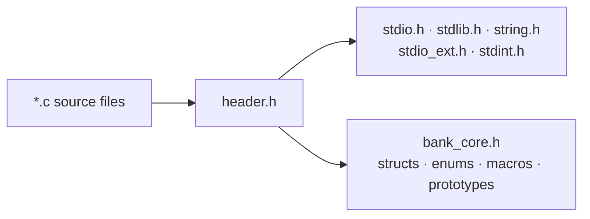
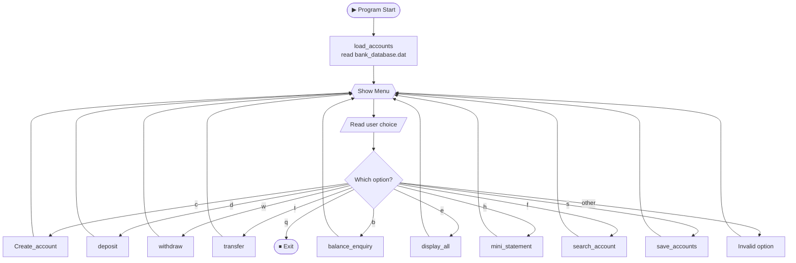
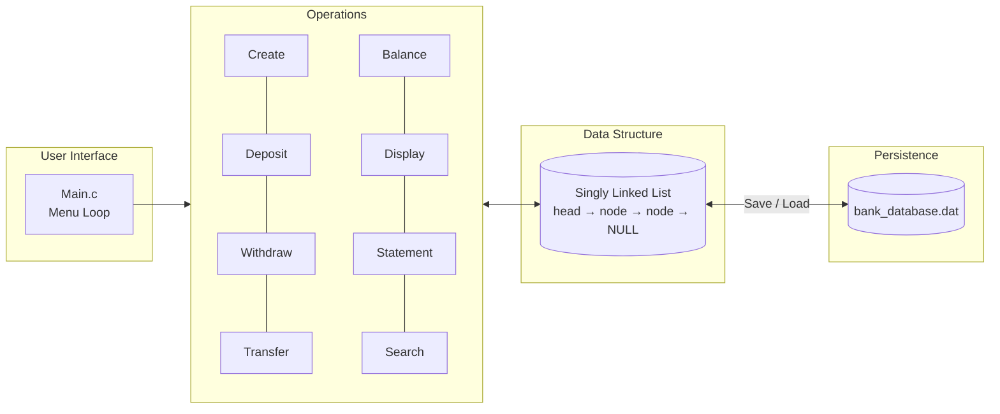
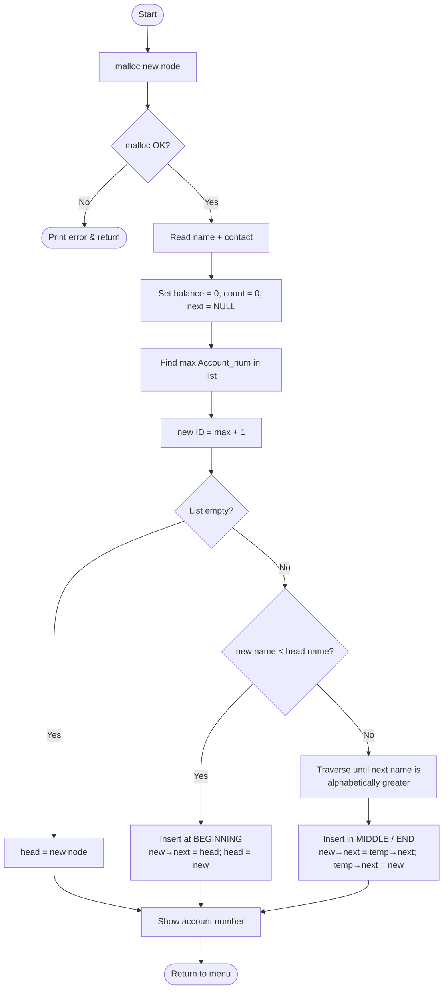
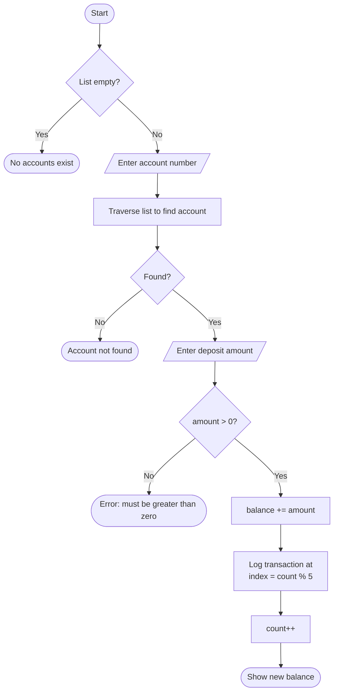
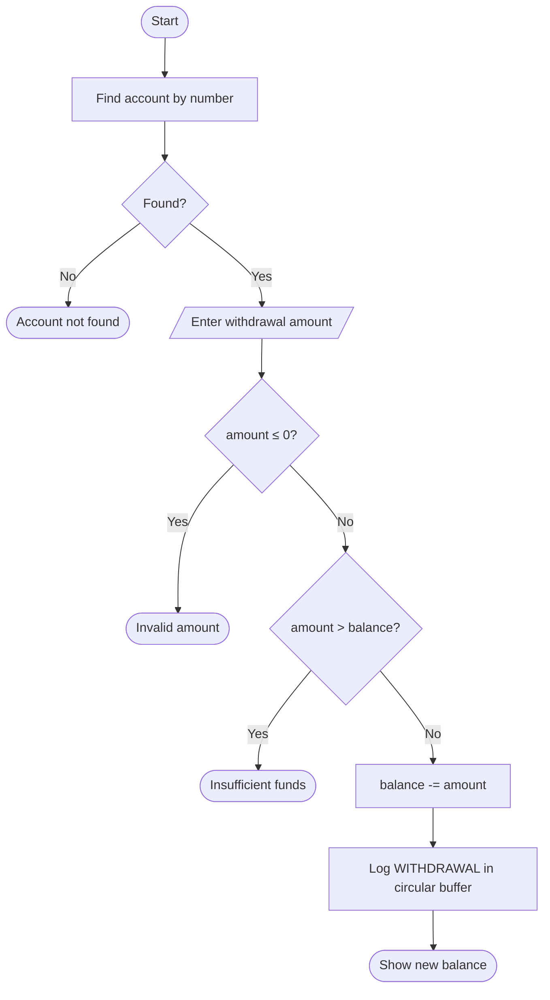
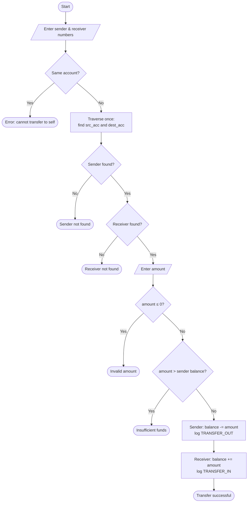
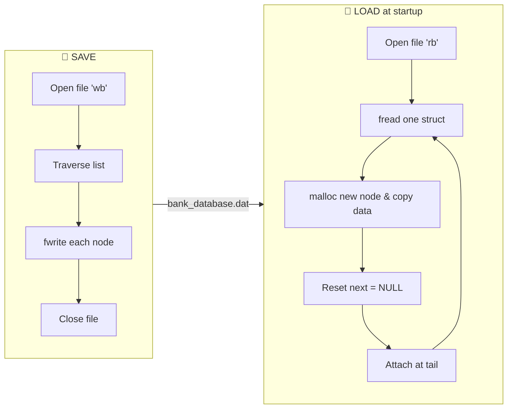

```mermaid
flowchart TD
    A([Start]) --> B[Find account]
    B --> C{Found?}
    C -- No --> Z1([Account not found])
    C -- Yes --> D{count == 0?}
    D -- Yes --> Z2([No transactions])
    D -- No --> E[max_to_show = min&#40;count, 5&#41;]
    E --> F[start_idx = count &gt; 5 ? count % 5 : 0]
    F --> G[Loop i = 0 → max_to_show-1]
    G --> H[idx = &#40;start_idx + i&#41; % 5]
    H --> I[Convert enum → text<br/>DEPOSIT / WITHDRAWAL / TRANSFER IN / OUT]
    I --> J[Print ID, Type, Amount]
    J --> G
    G --> K([Done])
```

<div align="center">

# 🏦 Bank Account Management System

### A menu-driven banking app in **C**, built on a **Singly Linked List**


*Create accounts · Deposit · Withdraw · Transfer · Check balance · View mini statements · Save & reload your data*

</div>

---

## 📑 Table of Contents

1. [About the Project](#-about-the-project)
2. [Features](#-features)
3. [Data Structures Used](#-data-structures-used)
4. [Project Structure](#-project-structure)
5. [System Architecture](#-system-architecture)
6. [How Each Module Works](#-how-each-module-works)
7. [Getting Started](#-getting-started)
8. [Sample Menu](#-sample-menu)
9. [Known Limitations & Future Improvements](#-known-limitations--future-improvements)
10. [Author](#-author)

---

## 📖 About the Project

This project is a **console-based banking system** written in C. It shows how a classic Data Structures concept, the **singly linked list**, can power a real application.

Every bank account is a **node** in a linked list. All operations (create, search, deposit, withdraw, transfer) are list traversals plus pointer manipulation. Data is saved to a **binary file**, so accounts survive after the program closes.

**Concepts practiced:**

- Dynamic memory allocation (`malloc`)
- Singly linked list: sorted insertion and traversal
- Circular buffer (fixed-size transaction history)
- Structs, enums, and typedefs
- Binary file I/O (`fread` / `fwrite`)
- Modular, multi-file C programming with a shared header

---

## ✨ Features

| Key | Feature | Description |
|:---:|---------|-------------|
| `c` | **Create Account** | Registers a new customer with an auto-generated unique account number |
| `d` | **Deposit** | Adds money to an account and logs the transaction |
| `w` | **Withdraw** | Removes money, with an insufficient-funds check |
| `t` | **Transfer** | Moves money between two accounts, logged on both sides |
| `b` | **Balance Enquiry** | Shows the owner's name and available balance |
| `e` | **Display All** | Lists every account in the system |
| `h` | **Mini Statement** | Shows the last 5 transactions of an account |
| `f` | **Search Account** | Finds an account by number and shows its details |
| `s` | **Save** | Writes all accounts to `bank_database.dat` |
| `q` | **Quit** | Exits the application |

**Highlights:**

- 🔤 Accounts are kept **alphabetically sorted by name** at insertion time
- 🔢 Account numbers are **auto-generated**, starting from `100001`
- 🔁 Transaction history uses a **circular buffer** that keeps only the latest 5 records
- 💾 **Auto-load** of saved data on startup
- 🛡️ Input validation for invalid amounts, missing accounts, same-account transfers, and insufficient funds

---

## 🧱 Data Structures Used

### 1. Transaction type (`enum`)

```c
typedef enum {
    DEPOSIT,
    WITHDRAWAL,
    TRANSFER_IN,
    TRANSFER_OUT
} TransactionType;
```

### 2. Transaction record (`struct`)

```c
typedef struct {
    uint32_t        transaction_ID;
    TransactionType type;
    double          amount;
} Account_Transaction;
```

### 3. Account node (linked list node)

```c
typedef struct AccountNode {
    uint32_t             Account_num;                 // unique ID (100001, 100002, ...)
    char                 Account_nme[MAX_NME_LEN];    // holder name (max 49 chars)
    char                 contact_num[MAX_PHN_LEN];    // phone number (max 14 chars)
    double               Account_balance;             // current balance
    Account_Transaction  transaction[MAX_HISY];       // circular buffer of last 5 transactions
    int                  Account_Transaction_count;   // total transactions ever made
    struct AccountNode  *next;                        // pointer to the next account
} Account;
```

### Memory layout of the list

```text
   head
    │
    ▼
┌───────────────┐    ┌───────────────┐    ┌───────────────┐
│ 100003        │    │ 100001        │    │ 100002        │
│ "Aman"        │    │ "Bhanu"       │    │ "Yugesh"      │
│ balance: 500  │    │ balance: 1200 │    │ balance: 80   │
│ next ─────────┼───▶│ next ─────────┼───▶│ next ─────▶ NULL
└───────────────┘    └───────────────┘    └───────────────┘
        Sorted alphabetically by NAME (not by account number)
```

### Constants

| Macro | Value | Purpose |
|-------|:-----:|---------|
| `MAX_NME_LEN` | 50 | Maximum size of the name field |
| `MAX_PHN_LEN` | 15 | Maximum size of the phone field |
| `MAX_HISY` | 5 | Number of transactions kept per account |

---

## 📁 Project Structure

```text
📦 Bank-Account-Management-System
 ┣ 📜 main.c               → Entry point, global head pointer, menu loop
 ┣ 📜 header.h             → Wrapper header: standard libraries + bank_core.h
 ┣ 📜 bank_core.h          → Structs, enums, macros, function prototypes
 ┣ 📜 create_account.c     → Creates an account (sorted insertion)
 ┣ 📜 deposit.c            → Deposit logic + transaction logging
 ┣ 📜 withdrawl.c          → Withdrawal logic + balance validation
 ┣ 📜 transfer.c           → Account-to-account transfer
 ┣ 📜 balance_enquiey.c    → Shows balance
 ┣ 📜 display_all.c        → Prints every account
 ┣ 📜 mini_statement.c     → Last 5 transactions (circular buffer read)
 ┣ 📜 serch_account.c      → Finds one account by number
 ┣ 📜 save_accounts.c      → Writes the list to disk
 ┗ 📜 load_accounts.c      → Rebuilds the list from disk
```

### Header design

Every `.c` file includes just one header, `header.h`, which pulls in everything else:



`main.c` owns the one global `Account *head`. Every other file reaches it with `extern Account *head;`.

---

## 🗺️ System Architecture

### 1. Overall program flow



### 2. Layered view



---

## 🔍 How Each Module Works

### 🆕 Create Account (`Create_Account.c`)

1. Allocates a new node with `malloc`.
2. Reads the **name** (spaces allowed) and **contact number**.
3. Sets balance to `0.0`, transaction count to `0`, and `next` to `NULL`.
4. **Generates the account number:** scans the whole list for the highest ID (default base `100000`) and uses `max + 1`.
5. **Inserts the node in alphabetical order** by name.



---

### 💰 Deposit (`Deposit.c`)



---

### 💸 Withdraw (`Withdrawl.c`)

Same as deposit, plus one extra check: the amount must not exceed the balance.



---

### 🔄 Transfer (`Transfer.c`)

The list is traversed **once** and both the sender and receiver are located in the same pass.



---

### 📜 Mini Statement (`Mini_Statement.c`): the circular buffer

Each account stores only its **last 5 transactions**. Instead of shifting data, the program writes in a ring:

```text
write index = Account_Transaction_count % 5
```

| Transaction # | 1 | 2 | 3 | 4 | 5 | 6 | 7 |
|:--|:-:|:-:|:-:|:-:|:-:|:-:|:-:|
| Stored at slot | 0 | 1 | 2 | 3 | 4 | **0** | **1** |

Transactions #6 and #7 overwrite the oldest entries (#1 and #2).

To print them **oldest → newest**, the start index is calculated like this:

```c
start_idx = (total > 5) ? (total % 5) : 0;
idx       = (start_idx + i) % 5;     // for i = 0 .. max_to_show-1
```



---

### 💾 Save & Load (`Save_Accounts.c`, `Load_Accounts.c`)



> **Why reset `next`?** The pointer saved in the file belongs to the *previous* run's memory and is invalid in a new session. Load sets it to `NULL` and relinks the nodes in file order, which preserves the alphabetical order.

---

### 🔎 Search / Balance / Display

All three use the same linear traversal:

```text
temp = head
while temp != NULL:
    if temp->Account_num == target → found
    temp = temp->next
```

- **Search** prints full details (number, name, contact, balance)
- **Balance enquiry** prints the name and balance only
- **Display all** prints every node from `head` to `NULL`

**Time complexity:**

| Operation | Complexity |
|-----------|:----------:|
| Search / Deposit / Withdraw / Balance / Statement | `O(n)` |
| Create account (ID scan + sorted insert) | `O(n)` |
| Transfer (single pass) | `O(n)` |
| Display all / Save / Load | `O(n)` |

---

## 🚀 Getting Started

### Prerequisites

- A **Linux** environment (or WSL on Windows)
- **GCC** compiler

### Note on filenames

Linux is case-sensitive, so keep all filenames **lowercase** (`header.h`, `bank_core.h`) to match the `#include` lines.

### Build & Run

```bash
# 1. Clone the repository
git clone https://github.com/Yugesh17repo/Bank-management-system-c.git
cd Bank-management-system-c

# 2. Compile all source files
gcc *.c -o bank

# 3. Run
./bank
```

---

## 🖥️ Sample Menu

```text
========== MENU ==========
c/C: Create account
d/D: Deposit amount
w/W: Withdrawl amount
t/T: Transfer amount
b/B: Balance enquiry
e/E: Display acocunt
h/H: Transaction Mini statement(History)
f/F: Search account
s/S: save the accounts info
q/Q: Quit from app
~~~~~~~~~~~~~~~~~~~~~~~~~~~~
Enter your choice:
```

**Sample session:**

```text
--- Create New Account ---
Enter Account Name: Yugesh Roshan
Enter Contact Number: 9876543210

Success! Account created.
Your unique Account Number is: 100001
```

```text
--- Statement for Yugesh Roshan ---
Current Balance: $1500.00
--------------------------------------------------
Receipt ID   | Type            | Amount
--------------------------------------------------
10000        | DEPOSIT         | $2000.00
10001        | WITHDRAWAL      | $500.00
```

---

## ⚠️ Known Limitations & Future Improvements

**Current limitations**

- Uses Linux-specific calls (`system("clear")`, `__fpurge`), so it won't run natively on Windows
- Data is saved **only when you choose `s`**, so unsaved changes are lost on quit
- Saving with zero accounts does nothing (an old file is not cleared)
- Search on an empty system returns to the menu without the "press enter" pause the other options have
- The account-lookup loop and transaction-logging block are repeated across several files
- The binary save file depends on struct layout, so it is not portable across different systems
- Transaction IDs are per-account (`10000 + count`), not globally unique
- `scanf` input is not fully protected against non-numeric entries

**Ideas for the future**

- [ ] Auto-save on exit
- [ ] Refactor repeated code into helpers like `find_account()` and `log_transaction()`
- [ ] Delete / update account
- [ ] PIN-based authentication
- [ ] Timestamps in transactions
- [ ] Cross-platform support (Windows / macOS)
- [ ] Switch to a hash table or BST for faster lookup
- [ ] Unit tests and a `Makefile`

---

## 👨‍💻 Author

<div align="center">

### **Yugesh Roshan**

*Built with ❤️ and C as a Data Structures project.*

⭐ If you found this project helpful, consider giving it a star!

</div>
