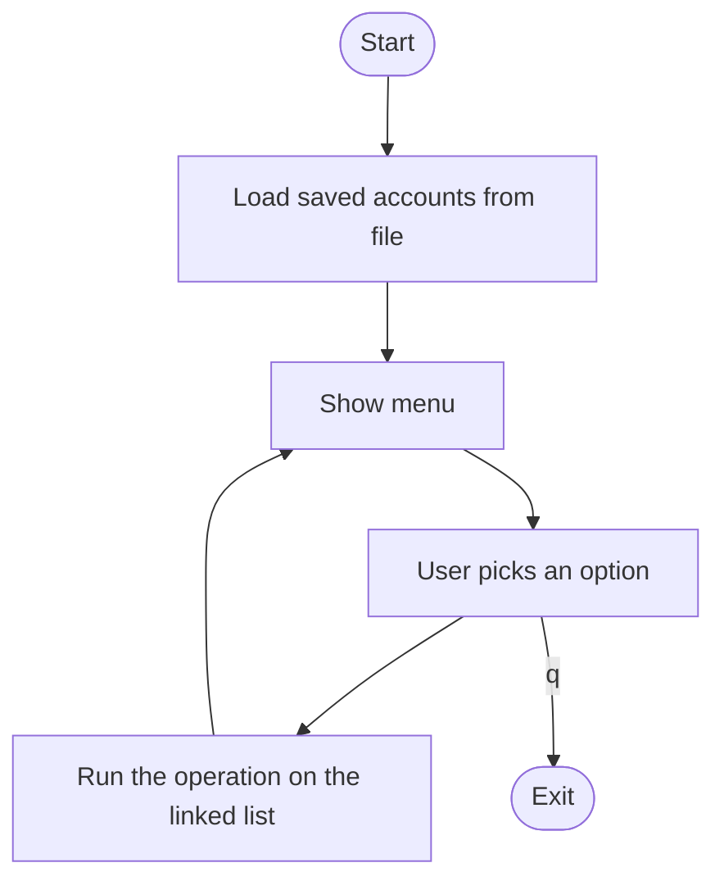

<div align="center">

# 🏦 Bank Account Management System

A simple menu-driven banking app in **C** using a **singly linked list**


</div>

---

## 📖 About

This is a console-based banking system written in C. Every account is a **node in a linked list**, and all operations are list traversals. Data is saved to a binary file, so accounts are still there the next time you run the program.

## ✨ Features

| Key | Feature |
|:---:|---------|
| `c` | Create account (auto account number, sorted by name) |
| `d` | Deposit money |
| `w` | Withdraw money (with insufficient-funds check) |
| `t` | Transfer money between accounts |
| `b` | Balance enquiry |
| `e` | Display all accounts |
| `h` | Mini statement (last 5 transactions) |
| `f` | Search account by number |
| `s` | Save accounts to file |
| `q` | Quit |

## 🔄 How It Works



**Key ideas:**

- **Linked list:** each account is a node. New accounts are inserted in **alphabetical order** by name.
- **Account numbers:** auto-generated, starting from `100001`.
- **Transaction history:** each account keeps its last 5 transactions in a **circular buffer** (`count % 5`), so the oldest one is overwritten automatically.
- **Save / Load:** `fwrite` saves every node to `bank_database.dat`. On startup, `fread` rebuilds the list and resets each `next` pointer.

```text
head
 │
 ▼
[Aman | 100003] ──▶ [Bhanu | 100001] ──▶ [Yugesh | 100002] ──▶ NULL
        (sorted alphabetically by name)
```

## 🧱 Main Data Structure

```c
typedef struct AccountNode {
    uint32_t            Account_num;
    char                Account_nme[50];
    char                contact_num[15];
    double              Account_balance;
    Account_Transaction transaction[5];     // circular buffer
    int                 Account_Transaction_count;
    struct AccountNode *next;
} Account;
```

## 📁 Project Structure

```text
├── main.c              Menu loop and global head pointer
├── header.h            Includes standard libraries + bank_core.h
├── bank_core.h         Structs, enums, prototypes
├── create_account.c    Create account (sorted insert)
├── deposit.c           Deposit
├── withdrawl.c         Withdraw
├── transfer.c          Transfer
├── balance_enquiey.c   Balance enquiry
├── display_all.c       Show all accounts
├── mini_statement.c    Last 5 transactions
├── serch_account.c     Search account
├── save_accounts.c     Save to file
└── load_accounts.c     Load from file
```

## 🚀 Getting Started

**Requirements:** Linux (or WSL on Windows) and GCC.

```bash
git clone https://github.com/Yugesh17repo/Bank-management-system-c.git
cd Bank-management-system-c
gcc *.c -o bank
./bank
```

## 🖥️ Sample Output

```text
========== MENU ==========
c/C: Create account
d/D: Deposit amount
w/W: Withdrawl amount
t/T: Transfer amount
b/B: Balance enquiry
e/E: Display acocunt
h/H: Transaction Mini statement(History)
f/F: Search account
s/S: save the accounts info
q/Q: Quit from app
~~~~~~~~~~~~~~~~~~~~~~~~~~~~
Enter your choice:
```

## ⚠️ Limitations

- Works on Linux only (`system("clear")` and `__fpurge`)
- Data is saved only when you press `s`
- Input is not fully protected against non-numeric entries

## 👨‍💻 Author

**Yugesh Roshan**

⭐ If you like this project, give it a star!
